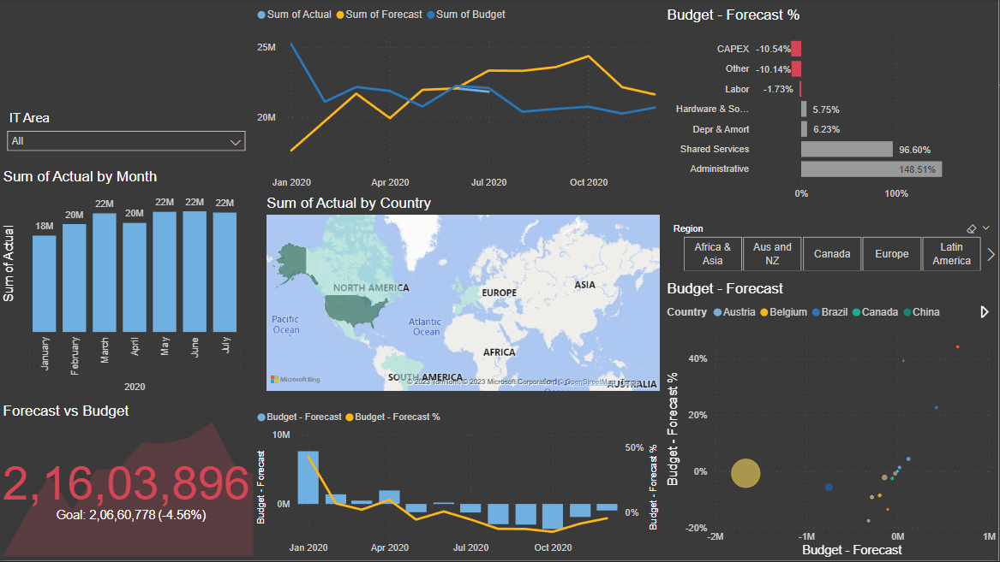

# Spend-Analysis-Power-BI
The repository contains a Power BI report generated from an online dataset, which contains information about the financial information of a company

- Cleaned and transformed data using Power Query.
- Created interactive visualizations using the 'Q&A' feature, various charts, with conditional formatting.
- Using the DAX feature, new measures were calculated and the same were used to create attractive visuals. 

